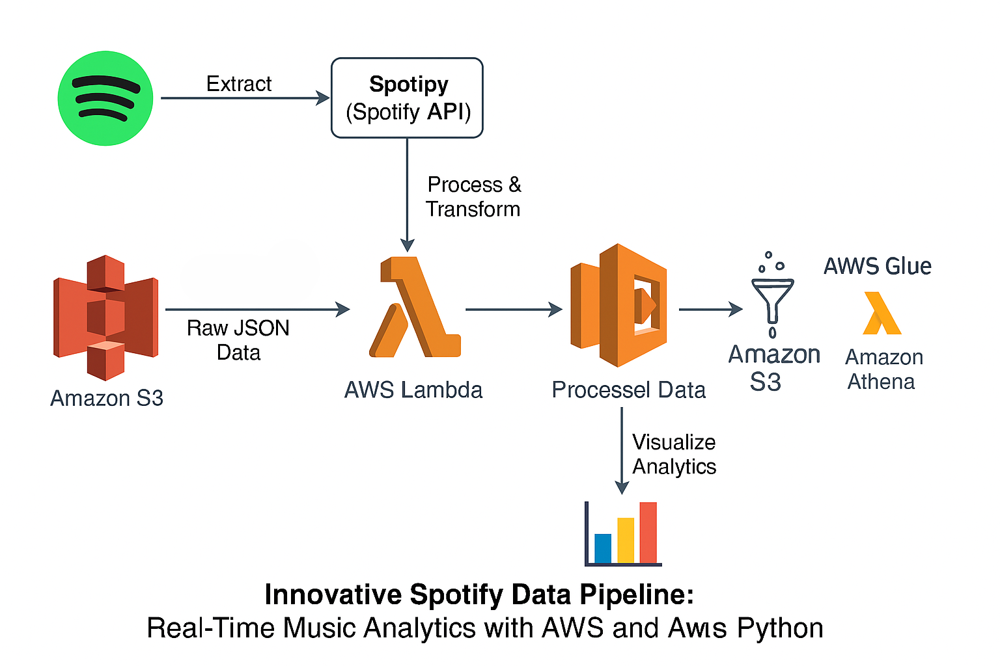

# Innovative Spotify Data Pipeline: Real-Time Music Analytics with AWS and Python

### Introduction
This project builds a Spotify ETL (Extract, Transform, Load) data pipeline using Python and AWS to collect music data from the Spotify API, process it, and load it into AWS for analysis. The pipeline is automated, scalable, and efficient, making it ideal for real-time analytics on music trends.

### Architecture

